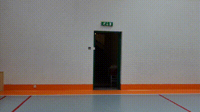
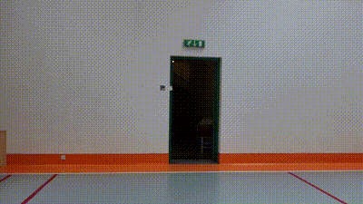

# TechFest Object Detection Challenge: YOLO11 + SAM2

## About

This project addresses **Challenge 2: Object Detection** for TechFest 2024 for **Qualcomm VisionX**. The goal is to develop an object detection model that can accurately detect, classify, and localize multiple objects within images or video frames. We integrate **YOLO11** for real-time object detection with **BOT_sort** for Object Tracking and **SAM2 (Segment Anything Model)** for precise object segmentation.


## Objective

- Detect objects with high precision, minimizing false positives and negatives.
- Achieve real-time or near real-time performance for practical applications.
- Adapt to diverse environments, including varying lighting, angles, and occlusions.
- Demonstrate applications in scenarios like surveillance, autonomous driving, or retail automation.
- Include object tracking capabilities across multiple video frames.

## Installation

Clone the repository and install the dependencies:

```bash
git clone https://github.com/Pin4sf/TechFest_YOLO11_SAM2.git
cd TechFest_YOLO11_SAM2 
```

## Overview

We are using the Ultralytics YOLO11 model for object detection and the Meta's Segment Anything Model (SAM2) for object segmentation. The YOLO11 model is an advanced version of YOLO that offers improved accuracy and real-time performance. SAM2 is a state-of-the-art segmentation model that can segment any object in an image with high precision.

### Why YOLO11 ?
-  **Real-Time Detection:** YOLOv11 offers superior speed while maintaining high accuracy, making it ideal for real-time applications in dynamic environments.
  
- **High Precision:** YOLOv11 minimizes both false positives and false negatives with better performance on small and overlapping objects compared to other models.
- **End-to-End Architecture:** It uses a single neural network to predict class probabilities, bounding box coordinates, and confidence scores simultaneously, resulting in faster processing.
- **Flexibility and Scalability:** YOLOv11 supports detection across multiple object classes and varied environments (lighting, occlusions, etc.).
 - **Key Advantage:** Faster than traditional CNN-based methods (like Faster R-CNN), suitable for real-time applications like surveillance and autonomous driving.

### Why SAM2 ?
- **Superior Segmentation:** SAM2 can segment objects in complex scenes with pixel-perfect precision, useful for scenarios with occlusions or highly cluttered environments.
- **Zero-Shot Segmentation:** SAM2 can detect and segment novel object categories without the need for additional training, adding robustness in unpredictable environments.
- **Enhanced Localization:** SAM2's segmentation capabilities allow for precise localization of objects, especially when objects overlap or are partially obscured.
- **Integration with YOLOv11:** By combining SAM2's segmentation with YOLOv11’s detection, we achieve greater accuracy in multi-object environments.

### Requirements
- Python 3.8 or higher
- PyTorch
- OpenCV
- Matplotlib
- Ultralytics YOLO11
- Segment Anything Model (SAM2)
- Jupyter Notebook

## Methodology

1. **Data Preparation**:
   - Load input images or video frames for object detection.
   - Preprocess images for YOLO11 and SAM2 input formats.
  
2. **Object Detection and Tracking**: 
   - Use YOLO11 to detect objects in the input images or video frames.
   - Extract bounding boxes, class labels, and confidence scores for detected objects.
   - Track objects across frames using BOT_sort, which efficiently handles multiple objects and occlusions. BOT_sort also retains object identity across frames, even if an object temporarily leaves and re-enters the frame.
3. **Object Segmentation**:
   - Use SAM2 to segment detected objects and refine the boundaries for precise localization.
   - Generate pixel-wise masks for each object to separate them from the background.
   - Combine segmentation results with detection for accurate object localization.
4. I**Integrating YOLO11 and SAM2**:
   - Combine the detection results from YOLO11 with the segmentation results from SAM2 to achieve accurate object detection and localization.
   - Use the tracking information to maintain consistency across frames and track objects effectively.
   - Align annotation formats between YOLO11 and SAM2 by converting SAM2 output to YOLO11-compatible format for final output.

## Features

- **YOLO11**: Advanced version of YOLO for real-time object detection with improved accuracy.
- **SAM2**: Enhanced segmentation model for precise object boundaries.
- **Real-time Detection**: Processes images and video frames swiftly for real-world applications.
- **Diverse Environment Handling**: Robust to various lighting conditions, angles, and occlusions.
- **Object Tracking**: Tracks detected objects across video frames.

##  Our Work
Currently, we have implemented YOLO11 for object detection and BOT_sort for tracking as well as SAM2 for segmentation. We are working on integrating and refining code to combine detection and segmentation outputs for the final results.

Refer the following Coalb links :-

| Segmentation | Detection and Tracking | 
|-------------|-----------|
|[](https://colab.research.google.com/drive/13vH1GwwO2DtbVQX8m0-sAQN3XU8N7b7L?authuser=1#scrollTo=zowxg0p5cBYa) | [](https://colab.research.google.com/drive/16SPJQ3pVzC1UYCN_UPveYL5Eqp93f6vW?usp=sharing)  |


## Results

This solution effectively detects and segments objects in diverse scenarios, making it suitable for applications like:

- **Surveillance**: Identifying and tracking people or objects in security footage.
- **Autonomous Driving**: Detecting vehicles, pedestrians, and obstacles in real-time.
- **Retail Automation**: Identifying products on shelves or tracking customer movements.

| Input Frame | Detection | Segmentation | Tracking |
|-------------|-----------|--------------|----------|
| |  |  |  |


## References

- [YOLO by Ultralytics](https://github.com/ultralytics/yolov5)
- [Segment Anything Model (SAM2)](https://github.com/facebookresearch/segment-anything)
